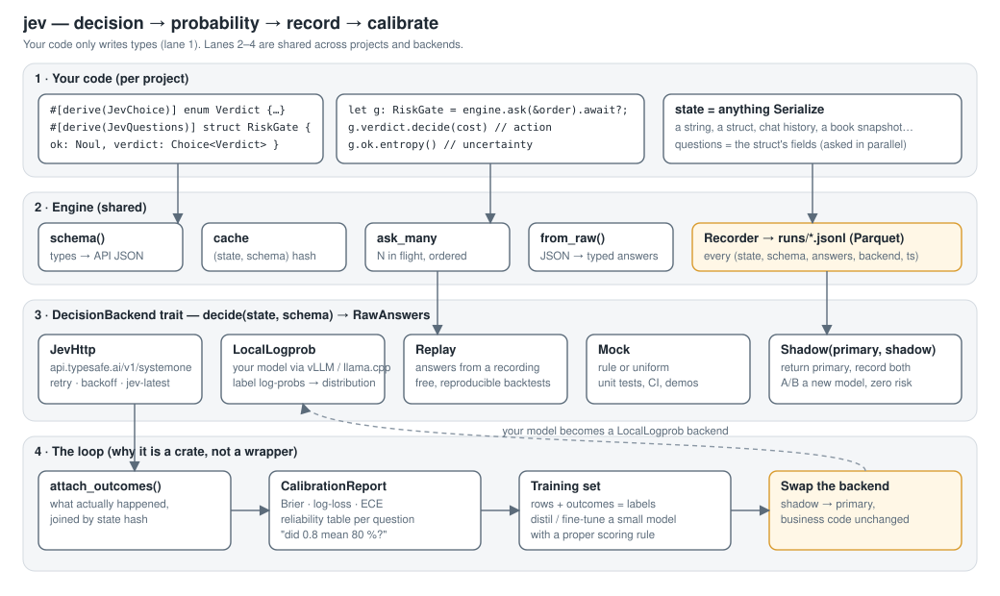
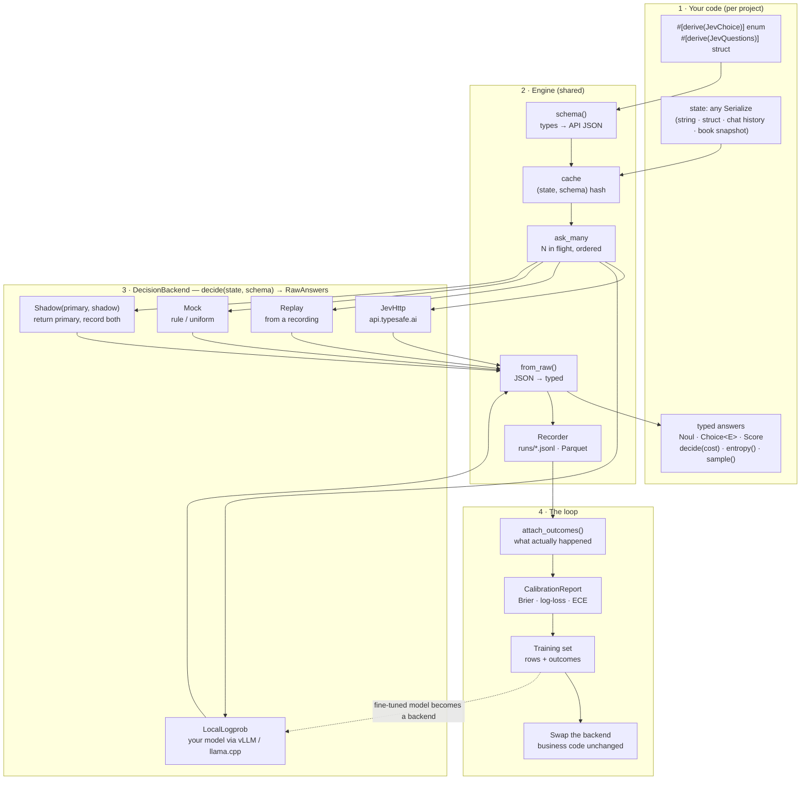

# Architecture / 架构

## Flow (Mermaid)

## Layers / 分层

| Layer | What it owns | 你写的 / 共享的 |
|---|---|---|
| Types | `Noul`, `Choice<E>`, `Score`; derive macros | 每个项目只写这一层 |
| Engine | typing, cache, batching, recording | 共享 |
| Backends | `DecisionBackend` trait + 5 implementations | 共享；自己的模型也是一个 backend |
| Loop | outcomes → calibration → training set → swap | 共享 |

## Design notes / 设计说明

* **`QuestionSchema` serialises 1:1 to the official API's `questions` object.** The derive macro builds it; the HTTP backend sends it verbatim; a custom backend receives the same structure. There is no second schema language.
* **Answers keep the full distribution.** `Choice` exposes every option's probability, not just the arg-max, so `decide(cost)` can minimise expected loss and `sample()` can drive stochastic agents.
* **Hashes, not ids.** Records, cache and replay are keyed by the SHA-256 of the canonical state JSON plus the schema hash. Two processes labelling the same data produce joinable rows without coordination.
* **Shadow never fails the primary.** A shadow error is recorded as a `shadow-error` row; the caller sees the primary answer.
* **`LocalLogprob` is the read-out half of a System One model.** It turns any instruction-tuned LLM into a schema-constrained classifier by reading label log-probs. Calibration is the training half — that is what the recorder and the report are for.

* **`QuestionSchema` 与官方 API 的 `questions` 对象一一对应。** 宏生成它，HTTP backend 原样发送，自定义 backend 收到同样的结构，没有第二套 schema 语言。
* **答案保留完整分布。** `Choice` 暴露每个选项的概率而不只是 argmax，所以 `decide(cost)` 可以最小化期望损失，`sample()` 可以驱动随机 agent。
* **用哈希不用 id。** 记录、缓存、回放都以「状态 JSON 的 SHA-256 + schema 哈希」为键，两个进程各自打标的结果无需协调就能 join。
* **Shadow 永远不会拖垮主 backend。** 影子出错记一行 `shadow-error`，调用方照常拿到主答案。
* **`LocalLogprob` 是 System One 模型的「读出」那一半。** 它把任何指令微调的 LLM 变成受 schema 约束的分类器（读取选项标签的 logprob）；「校准」那一半靠训练——这正是 recorder 和 calibration report 存在的意义。
